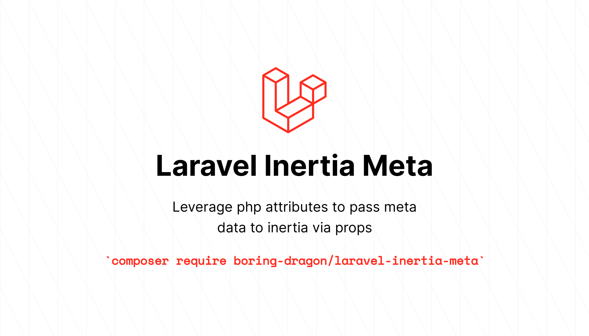

[](https://github.com/boring-dragon/laravel-inertia-meta-attributes/actions/workflows/fix-php-code-style-issues.yml)
[](https://github.com/boring-dragon/laravel-inertia-meta-attributes/actions/workflows/phpstan.yml)
[](https://github.com/boring-dragon/laravel-inertia-meta-attributes/actions/workflows/run-tests.yml)

## Installation

You can install the package via composer:

```bash
composer require boring-dragon/laravel-inertia-meta-attributes
```

## Usage

In your controller

```php
class WelcomeController extends Controller
{
    #[Page(
        title: 'Welcome',
        description: 'This is the welcome page'
    )]
    public function welcome(): Response
    {
        return Inertia::render('Welcome', [
            'canLogin' => Route::has('login'),
            'canRegister' => Route::has('register'),
            'laravelVersion' => Application::VERSION,
            'phpVersion' => PHP_VERSION,
        ])->withPageMeta();
    }
}
```

Now in your returned vue file you should have access to `meta` prop that has the page attribute data in it and can be rendered like so

```vue
<script setup lang="ts">
</script>

<template>
    <Head>
        <title>{{ meta.title }}</title>
        <meta name="title" :content="meta.title">
        <meta name="description" :content="meta.description">
    </Head>
</template>
```
## Testing

```bash
composer test
```

## Credits

- [Mohamed jinas](https://github.com/boring-dragon)
- [All Contributors](../../contributors)

## License

The MIT License (MIT). Please see [License File](LICENSE.md) for more information.
